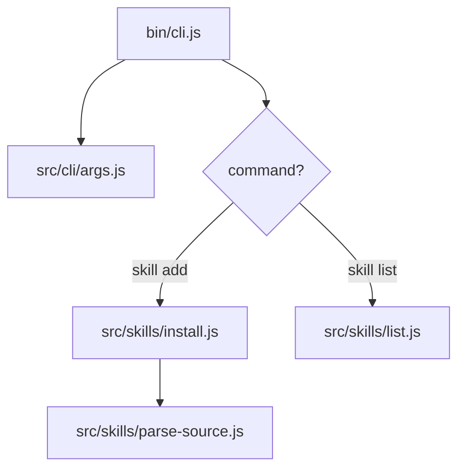
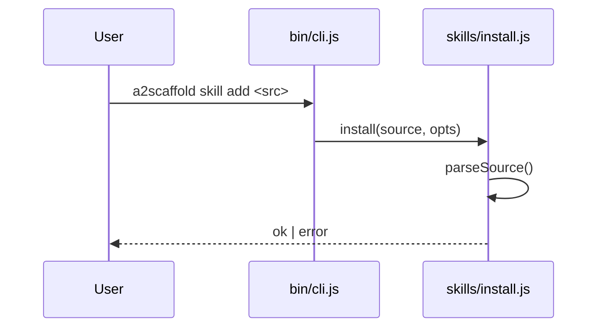

## Trigger

Activate this skill when the user asks for any of:

- An overview of the repo or a subsystem ("how does the CLI work?",
  "explain the skills pipeline").
- A walkthrough of a specific flow ("what happens when I run
  `a2scaffold skill add`?").
- Onboarding material for a new contributor.

Do **not** activate for narrow code questions ("what does this
function return?") — answer those directly.

## Why Mermaid, not strict UML

Mermaid diagrams-as-code render inline in GitHub, VS Code, and most
markdown viewers without a toolchain. Strict UML (PlantUML, 14-diagram
spec) is heavier than this repo needs. Stick to the four Mermaid
diagram types below.

## Procedure

### 1. Scope the explanation

Ask (or infer from the question):

- **Depth:** 10,000-ft overview, or a specific flow?
- **Audience:** new contributor, or someone debugging a specific
  subsystem?
- **Output location:** inline chat reply, or a file under
  [docs/](../../../docs/)?

If you cannot answer these from context, ask one clarifying question
before drawing.

### 2. Read the relevant code first

Never diagram from assumptions. For each subsystem mentioned, read
the entry points and follow the call graph one level deep. At
minimum:

- Entry point (e.g. [bin/](../../../bin/) or
  [src/cli/index.js](../../../src/cli/index.js))
- The concern files it dispatches to
- Any shared helpers under [src/utils/](../../../src/utils/)

### 3. Pick the diagram type

| Question the user is asking  | Diagram type            |
| ---------------------------- | ----------------------- |
| "What are the pieces?"       | `flowchart` (component) |
| "What happens when I run X?" | `sequenceDiagram`       |
| "What are the states?"       | `stateDiagram-v2`       |
| "How does data move?"        | `flowchart LR`          |

Use **one** diagram per question. If the answer truly needs two,
write two — but never stack three+ diagrams in one reply; split into
sections.

### 4. Draw

Template — component view:

````markdown

````

Template — sequence view:

````markdown

````

Rules:

- Node labels are **file paths** or **function names** from the
  current code — not invented abstractions.
- Keep ≤ 12 nodes per diagram. If it doesn't fit, the scope is too
  wide — split.
- No colors, no theming — let the viewer's renderer handle it.

### 5. Add a short narrative

After the diagram, write 3–6 bullets: what happens, in what order,
and where to look in the code. Each bullet ends with a clickable
file reference, e.g. `see [src/skills/install.js:42](src/skills/install.js#L42)`.

Do **not** restate the diagram in prose — the diagram is the
picture, the bullets are the captions.

### 6. Regenerate, don't cache

Diagrams drift from code fast. When asked about a subsystem that
was diagrammed before:

1. Re-read the current code.
2. Regenerate from scratch.
3. If a diagram file already exists under [docs/](../../../docs/),
   overwrite it — don't try to patch the old one.

## Output locations

| Request shape                | Where to put the output          |
| ---------------------------- | -------------------------------- |
| Conversational "explain X"   | Reply inline in chat             |
| "Add a docs page for X"      | `docs/diagrams/<name>.md`        |
| "Update the README overview" | Edit the relevant README section |

## Anti-patterns

- ❌ Drawing from memory of what the code "probably" does.
- ❌ Using UML-specific syntax (`<<interface>>`, lifelines with
  activation bars) — Mermaid has its own conventions.
- ❌ One mega-diagram of the whole repo. Pick a slice.
- ❌ Copying a diagram from an older doc without re-reading the code.
