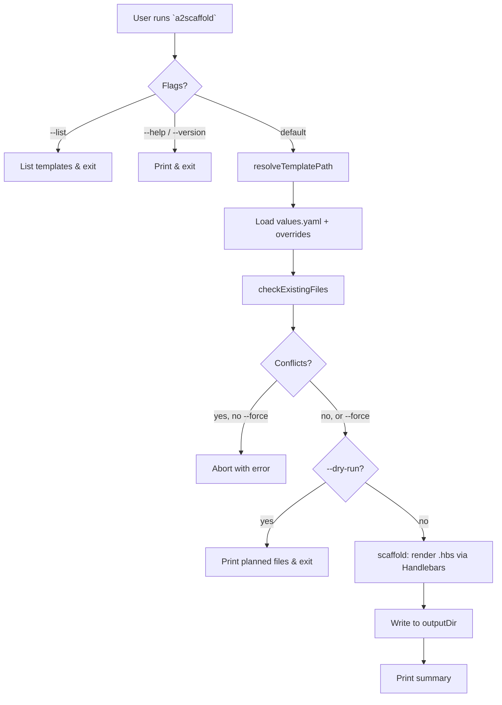

# Scaffold Workflow

> End-to-end flow for `a2scaffold` (default command) — rendering a template
> into an output directory.

## Overview

## Inputs

| Input          | Source                | Default             |
| -------------- | --------------------- | ------------------- |
| `templateName` | `--use` flag          | `base`              |
| `outputDir`    | `--output` flag       | `.` (cwd)           |
| `project.name` | `--name` flag         | basename(outputDir) |
| `overrides`    | programmatic API only | `{}`                |

## Steps

1. **Parse args** — CLI flags or programmatic options.
2. **Resolve template** — `resolveTemplatePath(name)` locates
   `templates/<name>/{template,values.yaml,partials?}`.
3. **Merge values** — deep-merge `overrides` over `values.yaml` defaults;
   expose `process.env` as `env`.
4. **Conflict check** — `checkExistingFiles(templateDir, outDir)` returns
   the list of existing output files. Abort unless `--force`.
5. **Dry run** — if `--dry-run`, print planned files and exit (no writes).
6. **Render** — for each `.hbs` file, run Handlebars with merged values
   and registered partials; strip `.hbs` extension.
7. **Write** — create parent directories as needed, write rendered content.

## Exit codes

| Code | Meaning                                                         |
| ---- | --------------------------------------------------------------- |
| 0    | Success (or dry-run completed)                                  |
| 1    | Template not found, conflict without `--force`, or render error |

## Extension points

- **New template**: add `templates/<name>/` with `template/` and
  `values.yaml`. Picked up automatically by `listTemplates()`.
- **Shared partials**: place in `templates/<name>/partials/*.hbs`.
- **Programmatic use**: import `scaffold()` from the API —
  see [docs/api.md](../../api.md#scaffoldoptions).

## Related

> See [docs/ToC.md](../../ToC.md) for the full docs index.
