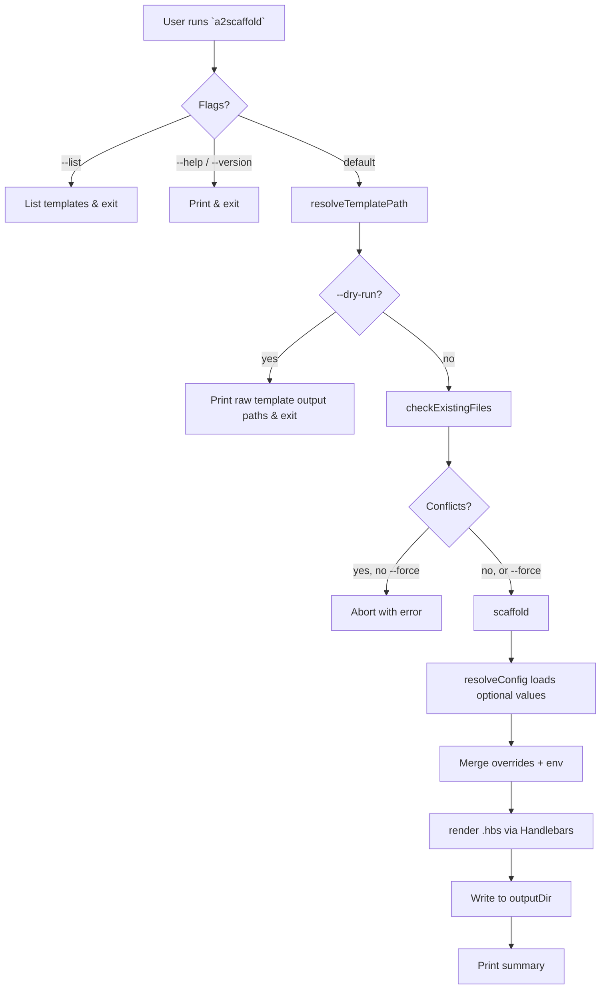

# Scaffold Workflow

> End-to-end flow for `a2scaffold` (default command) — rendering a template
> into an output directory.

## Overview

```mermaid
flowchart TD
  A[User runs `a2scaffold`] --> B{Flags?}
  B -->|--list| C[List templates & exit]
  B -->|--help / --version| D[Print & exit]
  B -->|default| E[resolveTemplatePath]
  E --> F{--dry-run?}
  F -->|yes| G[Print raw template output paths & exit]
  F -->|no| H[checkExistingFiles]
  H --> I{Conflicts?}
  I -->|yes, no --force| J[Abort with error]
  I -->|no, or --force| K[scaffold]
  K --> L[resolveConfig loads optional values]
  L --> M[Merge overrides + env]
  M --> N[render .hbs via Handlebars]
  N --> O[Write to outputDir]
  O --> P[Print summary]
```

## Inputs

| Input          | Source                | Default             |
| -------------- | --------------------- | ------------------- |
| `--use`        | CLI flag              | `base`              |
| `templateName` | CLI-derived/API value | `scaffold/base`     |
| `outputDir`    | `--output` flag       | `.` (cwd)           |
| `project.name` | `--name` flag         | basename(outputDir) |
| `overrides`    | programmatic API only | `{}`                |

## Steps

1. **Parse args** — CLI flags or programmatic options.
2. **Resolve template** — the CLI prepends `scaffold/` to `--use`, then
   `resolveTemplatePath(name)` locates `templates/<name>/template/` plus
   optional `values.yaml`, `values/`, and `partials/`.
3. **Dry run** — if `--dry-run`, print raw output paths from `.hbs`
   templates and exit without rendering or writing.
4. **Conflict check** — `checkExistingFiles(templateDir, outDir)` returns
   the list of existing output files. Abort unless `--force`.
5. **Load and merge values** — `resolveConfig` loads optional template
   values and partials; `scaffold()` deep-merges `overrides` and exposes
   `process.env` as `env`.
6. **Render** — for each `.hbs` file, run Handlebars with merged values
   and registered partials; strip `.hbs` extension.
7. **Write** — create parent directories as needed, write rendered content.

## Exit codes

| Code | Meaning                                                         |
| ---- | --------------------------------------------------------------- |
| 0    | Success (or dry-run completed)                                  |
| 1    | Template not found, conflict without `--force`, or render error |

## Extension points

- **New scaffold template**: add `templates/scaffold/<name>/` with a
  `template/` directory. `values.yaml`, `values/`, and `partials/` are
  optional. Picked up automatically by `listTemplates()`.
- **Shared partials**: place in `templates/scaffold/<name>/partials/*.hbs`.
- **Programmatic use**: import `scaffold()` from the API —
  see [docs/api.md](../../api.md#scaffoldoptions).

## Related

> See [docs/ToC.md](../../ToC.md) for the full docs index.
