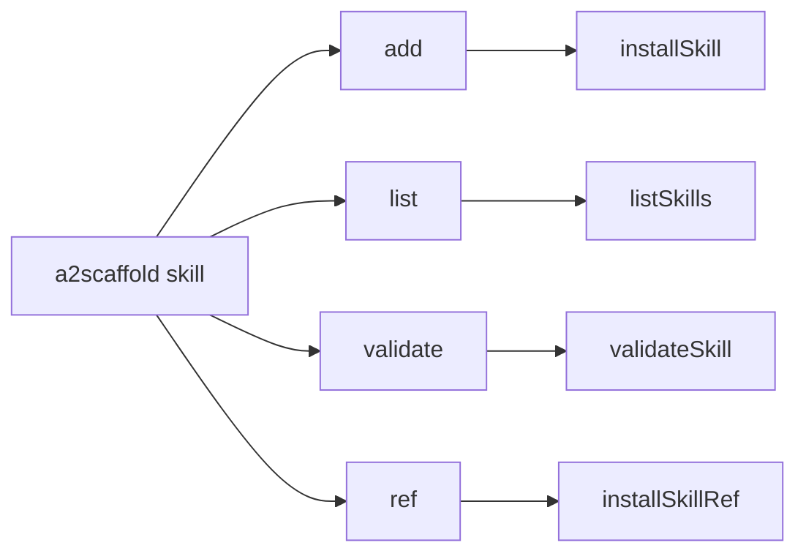
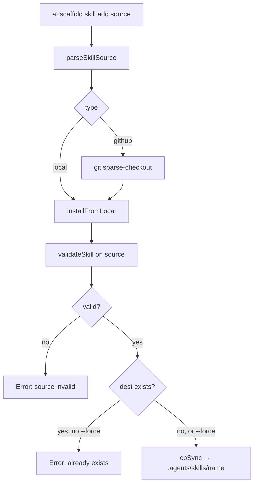
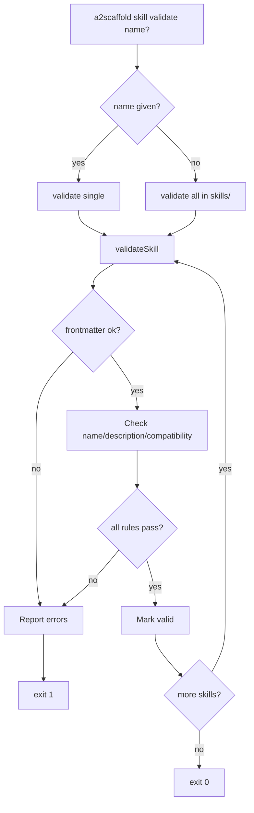
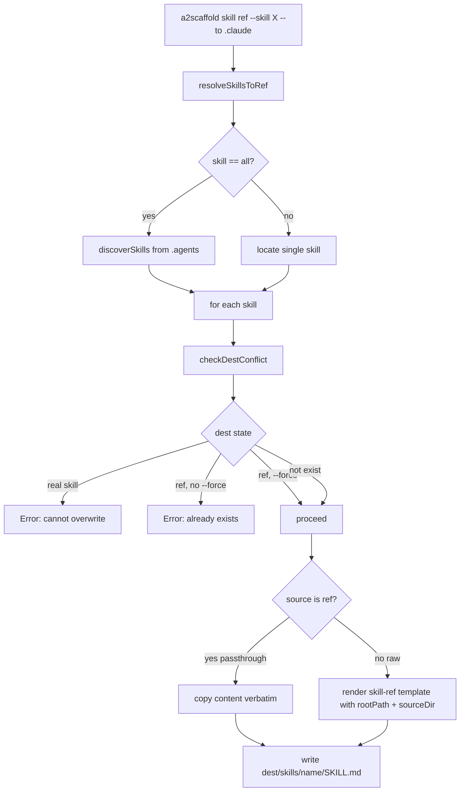

# Skill Workflow

> End-to-end flow for `a2scaffold skill <subcommand>` — managing Agent
> Skills and lightweight skill references (`skill-ref`).

## Subcommand map



## `skill add` — install a skill



**Sources:** local path, `owner/repo/path`, or full GitHub URL.

## `skill list` — list installed skills

Reads `<agentsDir>/skills/*/SKILL.md`, parses frontmatter, prints name +
description. Sorted alphabetically. Skips dirs without `SKILL.md` or
unparseable frontmatter.

## `skill validate` — validate against spec



**Validation rules** (see [src/skills/validate.js](../../../src/skills/validate.js)):

- `SKILL.md` must exist with YAML frontmatter
- `name`: 1-64 chars, `^[a-z0-9]([a-z0-9-]*[a-z0-9])?$`, matches dir name
- `description`: 1-1024 chars
- `compatibility` (optional): ≤500 chars

**Skill-ref chain validation** (implemented in [src/skills/ref-chain.js](../../../src/skills/ref-chain.js)):

When a skill has `metadata.type: skill-ref`, `validateSkill` also walks the
ref chain — resolving each hop via `metadata.rootPath` + the `@rootPath/<path>`
line in the body — and reports:

- `broken ref: target does not exist at "<path>"` — dead pointer
- `ref cycle detected: A → B → A` — visited-set detection
- `ref chain exceeds max depth (5)` — MAX_REF_DEPTH cap
- `terminal skill invalid: <err>` — bubbles errors from the raw terminal

## `skill ref` — create skill-refs

Creates lightweight pointer `SKILL.md` files in a destination agents dir
(e.g. `.claude/skills/`) that point back to skills in a source dir
(e.g. `.agents/skills/`). Used so multiple agent tools can share a single
authoritative skill definition.



**Conflict rules** (`installSkillRef`):

| Dest state          | No `--force` | With `--force`  |
| ------------------- | ------------ | --------------- |
| not exist           | create ref   | create ref      |
| existing skill-ref  | error        | overwrite       |
| existing real skill | error        | **still error** |

**Passthrough:** if the source SKILL.md already has
`metadata.type: skill-ref`, its content is copied verbatim so the final
file still resolves to the original real skill (CLI-generated chains stay
length 1).

## Directory layout across agent tools

```text
.agents/skills/<name>/SKILL.md   ← authoritative definition (raw)
.claude/skills/<name>/SKILL.md   ← skill-ref (pointer)
.codex/skills/<name>/SKILL.md    ← skill-ref (pointer)
.gemini/skills/<name>/SKILL.md   ← skill-ref (pointer)
.github/skills/<name>/SKILL.md   ← skill-ref (pointer)
```

## Related

> See [docs/ToC.md](../../ToC.md) for the full docs index.
